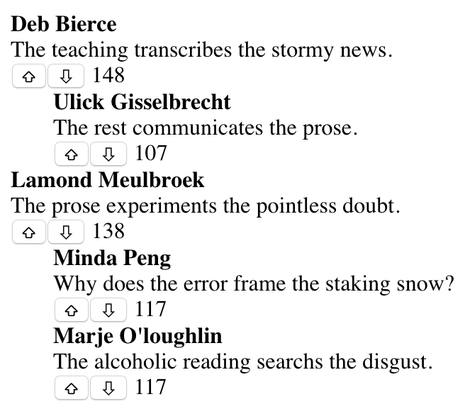

# Exercise Project

## The challenge

The objective is to build a single interactive page to display a list of top 10 voted `Posts` and their associated `Comments`.



Rough example of what your page may look like.

## Requirements

UI:

- Each `Post` and `Comment` should have upvote and downvote buttons.
- We should be able to click the upvote and downvote buttons repeatedly to affect the votes.
- Upon upvoting and downvoting, the page should update the order of the `Posts` and `Comments`.
- You should display at least `author`, `content` and `vote count` for every `Post` and `Comment`.

Backend:

- You will need to create 3 endpoints:

  - `GET` /top

    - Your endpoint should return the top **10** `Posts` sorted by their number of upvotes (don't include `Comment` upvotes when calculating upvotes for `Posts`).
    - Each `Post` being returned should also contain their top **3** highest upvoted `Comments`.
    - Your endpoint should return data in the following format:

    ```json
    [
        {
            "uuid": "e742e5fe-605d-4420-99f6-0dca8eadde0c",
            "author": "Laird Finnerty",
            "content": "The increase restores the wine.",
            "votes": 130,
            "comments": [
                {
                    "uuid": "e3f01b32-fa59-4b6a-bf5f-011dc70ef9f0",
                    "post-uuid": "e742e5fe-605d-4420-99f6-0dca8eadde0c",
                    "author": "Otis Palmieri",
                    "content": "How does the normal motion judge the doubt?",
                    "votes": 95
                },
                {
                    "uuid": "f800aa11-ccfa-4f01-8c0f-2fed032e3814",
                    "post-uuid": "e742e5fe-605d-4420-99f6-0dca8eadde0c",
                    "author": "Farly Tuckerman",
                    "content": "The physical chalk establishs the tin.",
                    "votes": 92
                },
                {
                    "uuid": "087a034c-f8c3-4151-80ee-8985fe9daf41",
                    "post-uuid": "e742e5fe-605d-4420-99f6-0dca8eadde0c",
                    "author": "Rodi Curtin",
                    "content": "The learning enlists the incompetent stone.",
                    "votes": 87
                }
            ]
        },
        {...},
        {...},
    ]
    ```

  - `POST` /upvote/{:id}

    - Your endpoint should increment the number of upvotes for the item (could be a `Post` or `Comment`) with the given id.
    - You can assume there will be no duplicate ids across `Posts` and `Comments`.

  - `POST` /downvote/{:id}
    - Your endpoint should decrement the number of upvotes for the item (could be a `Post` or `Comment`) with the given id.
    - You can assume there will be no duplicate ids across `Posts` and `Comments`.
    - Your endpoint should not allow votes to be negative i.e minimum votes should be 0.

## What you are provided with

- A set of JSON data files:
  - posts.json
  - comments.json
  - upvotes.json

## Rules

- You may use any JS framework e.g. Ember.js, React, Angular or no framework at all.
- You may use any language and framework for your backend.
- You should write as much of the business logic as possible without incorporating other complex tools e.g. use in-memory maps instead of Redis / Postgres.

## How you will be graded

1. Correctness

   - We will be running a few automated tests against your backend's endpoints to check if the order of the `Posts` and `Comments` are correct.

2. Optimisations

   - Your app should be optimised for the `GET` /top operation, so we would like to see sensible tradeoffs in your app to achieve this.

3. Clean code

   - Since the app is not extremely complex, some time should be spent making sure you are pleased with the quality of the code being submitted. **Hint**: You should use a linter.

4. Testing
   - It is important to have adequate testing at the right levels, as it shows us which functions of the app you consider more critical than others.

## Submission

- Please ensure you have a README that details how to run your project (including how to run tests).
- Please submit a _.zip_ or _.tar_ of the entire source directly through email (please reach out to us if this doesn't work) and ensure you **do not** push the code to any public repository.
